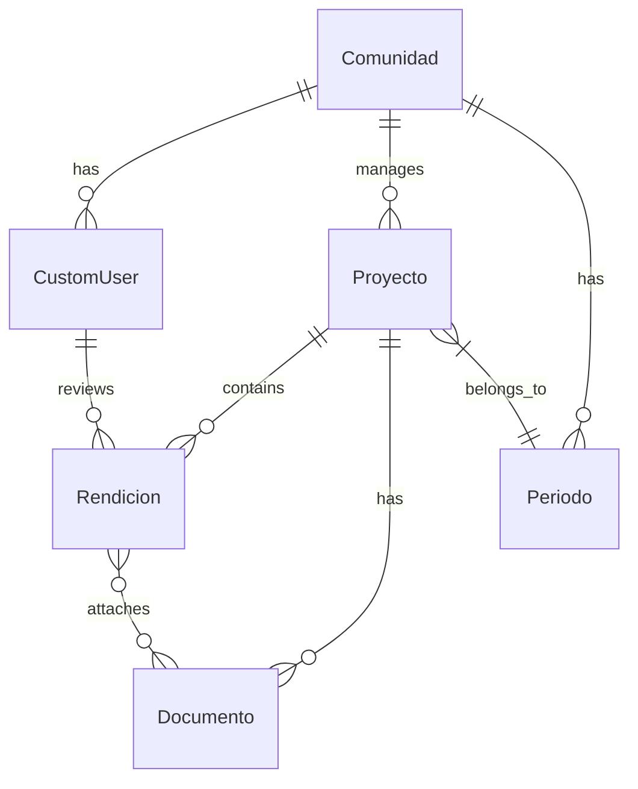

## Overview

Auditoriapp is a **multi-tenant SaaS platform** built with a modern Django REST Framework backend and React frontend. The system is designed for transparent fund management and auditing across multiple communities.

<CardGroup cols={2}>
  <Card title="Backend" icon="server">
    Django 5.0 with REST Framework and PostgreSQL/SQLite
  </Card>
  <Card title="Frontend" icon="react">
    React 18 with Vite, TailwindCSS, and React Router
  </Card>
  <Card title="Authentication" icon="lock">
    JWT-based authentication with role-based access control
  </Card>
  <Card title="API Documentation" icon="book">
    Auto-generated OpenAPI with drf-spectacular
  </Card>
</CardGroup>

## Backend Architecture

### Django Apps Structure

The backend is organized into modular Django apps, each handling specific domain logic:

```python
# auditoriapp/settings.py:28-51
INSTALLED_APPS = [
    'django.contrib.admin',
    'django.contrib.auth',
    'django.contrib.contenttypes',
    'django.contrib.sessions',
    'django.contrib.messages',
    'django.contrib.staticfiles',     
    'dashboard',         # KPI metrics and analytics
    'comunidades',       # Multi-tenant communities
    'proyectos',         # Project management
    'finanzas',          # Financial transactions
    'beneficiarios',     # Beneficiary management
    'documentos',        # Document storage
    'reportes',          # Report generation
    'rest_framework',    # REST API framework
    'corsheaders',       # CORS handling
    'usuarios',          # User management & auth
    'rendiciones',       # Fund accountability
    'periodos',          # Fiscal periods
    'auditores',         # Auditor management
    'socios',            # Community members
    'drf_spectacular',   # OpenAPI documentation
]
```

### Core Domain Models

#### Communities (Multi-Tenancy)

```python
# comunidades/models.py:20-27
class Comunidad(models.Model):
    nombre = models.CharField(max_length=255)
    activa = models.BooleanField(default=True)
    creada_en = models.DateTimeField(auto_now_add=True)
    usuario = models.ForeignKey(
        'usuarios.CustomUser', 
        on_delete=models.CASCADE, 
        null=True, 
        blank=True, 
        related_name='comunidades'
    )

    def __str__(self):
        return self.nombre
```

#### Projects

```python
# proyectos/models.py:13-44
class Proyecto(models.Model):
    comunidad = models.ForeignKey('comunidades.Comunidad', on_delete=models.CASCADE)
    periodo = models.ForeignKey('periodos.Periodo', on_delete=models.CASCADE)
    nombre = models.CharField(max_length=255)
    descripcion = models.TextField(default='') 
    fecha_inicio = models.DateField(null=True, blank=True) 
    fecha_fin = models.DateField(null=True, blank=True)
    presupuesto_total = models.DecimalField(max_digits=12, decimal_places=2, default=0)
    
    estado = models.CharField(max_length=50, choices=ESTADO_CHOICES, default='borrador')
    total_rendido = models.DecimalField(max_digits=12, decimal_places=2, default=0)
    estado_rendicion = models.CharField(max_length=50, default='Pendiente')
    
    # Governance
    objetivos = models.TextField(blank=True, default='')
    justificacion = models.TextField(blank=True, default='')
    beneficiarios_estimados = models.PositiveIntegerField(default=0)
    quorum_asamblea = models.PositiveIntegerField(default=0)
    
    # Digital signatures
    firma_presidente = models.BooleanField(default=False)
    fecha_firma_presidente = models.DateTimeField(null=True, blank=True)
```

#### Rendiciones (Accountability)

```python
# rendiciones/models.py:3-27
class Rendicion(models.Model):
    ESTADO_RENDICION = [
        ('pendiente', 'Pendiente'),
        ('aprobado', 'Aprobado'),
        ('observado', 'Con Observaciones'),
        ('rechazado', 'Rechazado'),
        ('pagado', 'Pagado'),
    ]

    proyecto = models.ForeignKey('proyectos.Proyecto', on_delete=models.CASCADE)
    descripcion = models.TextField(blank=True, null=True)
    monto_rendido = models.DecimalField(max_digits=12, decimal_places=2)
    numero_documento = models.CharField(max_length=50, blank=True, null=True)
    fecha_rendicion = models.DateField()
    documentos_adjuntos = models.ManyToManyField(
        'documentos.Documento', 
        related_name='rendiciones_adjuntas', 
        blank=True
    )

    # Review workflow
    estado = models.CharField(max_length=20, choices=ESTADO_RENDICION, default='pendiente')
    observacion = models.TextField(blank=True, null=True)
    revisor = models.ForeignKey('usuarios.CustomUser', on_delete=models.SET_NULL, null=True, blank=True)
    fecha_revision = models.DateTimeField(null=True, blank=True)
```

### API Design

#### URL Structure

```python
# auditoriapp/urls.py:13-32
urlpatterns = [
    path('admin/', admin.site.urls),
    path('api/schema/', SpectacularAPIView.as_view(), name='schema'),
    path('api/docs/', SpectacularSwaggerView.as_view(url_name='schema'), name='swagger-ui'),
    path('api/auth/', include('usuarios.urls')),
    path('api/comunidades/', include('comunidades.urls')),
    path('api/periodos/', include('periodos.urls')),
    path('api/finanzas/', include('finanzas.urls')),
    path('api/beneficiarios/', include('beneficiarios.urls')),
    path('api/documentos/', include('documentos.urls')),
    path('api/auditores/', include('auditores.urls')),
    path('api/reportes/', include('reportes.urls')),
    path('api/rendiciones/', include('rendiciones.urls')),
    path('api/', include('proyectos.urls')),
    path('api/dashboard/', include('dashboard.urls')),
    path('api/token/', CustomTokenObtainPairView.as_view(), name='token_obtain_pair'),
    path('api/token/refresh/', TokenRefreshView.as_view(), name='token_refresh'),
]
```

#### REST Framework Configuration

```python
# auditoriapp/settings.py:146-161
REST_FRAMEWORK = {
    'DEFAULT_AUTHENTICATION_CLASSES': (
        'rest_framework_simplejwt.authentication.JWTAuthentication',
    ),
    'DEFAULT_PERMISSION_CLASSES': (
        'rest_framework.permissions.AllowAny',
    ),
    'DEFAULT_SCHEMA_CLASS': 'drf_spectacular.openapi.AutoSchema',
}

SPECTACULAR_SETTINGS = {
    'TITLE': 'Auditoriapp API',
    'DESCRIPTION': 'API documentation for the community management and auditing SaaS system.',
    'VERSION': '1.0.0',
    'SERVE_INCLUDE_SCHEMA': False,
}
```

## Frontend Architecture

### Technology Stack

- **React 18** - Component-based UI library
- **Vite** - Fast build tool and dev server
- **React Router v6** - Client-side routing
- **TailwindCSS** - Utility-first CSS framework
- **Axios** - HTTP client for API communication

### Application Structure

```jsx
// src/App.jsx - Main routing
import React, { useState } from 'react';
import { BrowserRouter as Router, Routes, Route, Navigate } from 'react-router-dom';
import Layout from './components/Layout';
import Dashboard from './pages/Dashboard';
import Proyectos from './pages/Proyectos';
import ProyectoDetalle from './pages/ProyectoDetalle';
import Socios from './pages/Socios';
import Periodos from './pages/Periodos';
import Login from './pages/Login';
import CrearPeriodo from './pages/CrearPeriodo';

function App() {
  const [isAuthenticated, setIsAuthenticated] = useState(!!localStorage.getItem('access'));

  return (
    <Router>
      <Layout>
        <Routes>
          <Route path="/dashboard" element={<Dashboard />} />
          <Route path="/crear-periodo" element={<CrearPeriodo />} />
          <Route path="/proyectos" element={<Proyectos />} />
          <Route path="/proyectos/:id" element={<ProyectoDetalle />} />
          <Route path="/socios" element={<Socios />} />
          <Route path="/periodos" element={<Periodos />} />
          <Route path="/" element={<Navigate to="/dashboard" replace />} />
        </Routes>
      </Layout>
    </Router>
  );
}
```

### Component Organization

```
frontend/src/
├── components/          # Reusable UI components
│   ├── Layout.jsx       # Main layout wrapper
│   ├── DashboardCard.jsx
│   └── TablaGenerica.jsx
├── pages/               # Route-level pages
│   ├── Dashboard.jsx
│   ├── Proyectos.jsx
│   ├── ProyectoDetalle.jsx
│   ├── Rendiciones.jsx
│   ├── Socios.jsx
│   └── Login.jsx
├── utils/               # Helper functions
└── App.jsx              # Root component
```

## Database Schema

### Key Relationships



### Fiscal Period Management

```python
# periodos/models.py:8-27
class PeriodoManager(models.Manager):
    def periodo_actual(self, comunidad):
        hoy = timezone.now().date()
        return self.filter(
            comunidad=comunidad, 
            activo=True, 
            fecha_inicio__lte=hoy, 
            fecha_fin__gte=hoy
        ).order_by('-fecha_inicio').first()

class Periodo(models.Model):
    comunidad = models.ForeignKey(Comunidad, on_delete=models.CASCADE)
    nombre = models.CharField(max_length=255)
    fecha_inicio = models.DateField()
    fecha_fin = models.DateField()
    monto_asignado = models.DecimalField(max_digits=15, decimal_places=2, default=0)
    monto_anterior = models.DecimalField(max_digits=15, decimal_places=2, default=0)
    activo = models.BooleanField(default=True)

    objects = PeriodoManager()
```

## API Documentation

The system auto-generates OpenAPI documentation using **drf-spectacular**:

- **Swagger UI**: `/api/docs/`
- **ReDoc**: `/api/redoc/`
- **OpenAPI Schema**: `/api/schema/`

## CORS Configuration

```python
# auditoriapp/settings.py:141-179
CORS_ALLOWED_ORIGINS = [
    "http://localhost:5173",
    "http://127.0.0.1:5173",
]

CORS_ALLOW_CREDENTIALS = True
```

## Next Steps

<CardGroup cols={2}>
  <Card title="Multi-Tenancy" icon="building" href="/platform/multi-tenancy">
    Learn how data isolation works across communities
  </Card>
  <Card title="Security" icon="shield" href="/platform/security">
    Understand JWT authentication and role-based access
  </Card>
</CardGroup>
