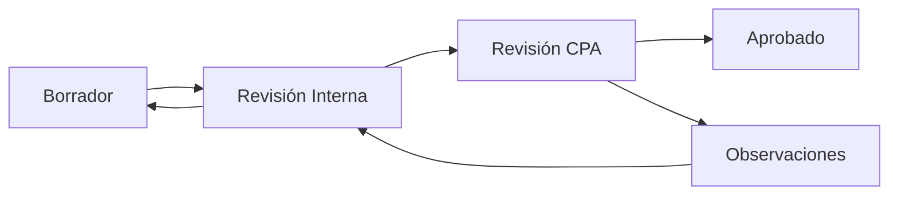

The **ITO** (Responsable) and **CPA Revisor** roles handle technical review and formal approval in Auditoriapp. These roles work together to ensure projects are properly executed and financially validated.

## Role Definitions

<CardGroup cols={2}>
  <Card title="ITO / Responsable" icon="hard-hat" iconType="duotone">
    Technical officer responsible for reporting physical project progress and execution status
  </Card>
  <Card title="CPA Revisor" icon="badge-check" iconType="duotone">
    Certified reviewer with authority to approve/reject projects and financial renditions
  </Card>
</CardGroup>

### Model Definition

```python
class CustomUser(AbstractUser):
    rol = models.CharField(max_length=20, choices=[
        ('ito', 'ITO / Responsable'),
        ('cpa', 'CPA Revisor'),
        # ... other roles
    ])
```

**Source:** `backend/usuarios/models.py:7-14`

### Permission Classes

```python
class IsITO(permissions.BasePermission):
    def has_permission(self, request, view):
        return request.user and request.user.is_authenticated and request.user.rol == 'ito'

class IsCPA(permissions.BasePermission):
    def has_permission(self, request, view):
        return request.user and request.user.is_authenticated and request.user.rol == 'cpa'
```

**Source:** `backend/usuarios/permissions.py:19-25`

## ITO (Responsable) Role

The ITO is the technical officer assigned to monitor and report on physical project execution.

### Core Responsibilities

<Steps>
  <Step title="Project Monitoring">
    Visit project sites and track physical progress against planned milestones
  </Step>
  <Step title="Progress Reporting">
    Submit regular reports documenting work completed, materials used, and timeline status
  </Step>
  <Step title="Quality Verification">
    Ensure work meets technical specifications and quality standards
  </Step>
  <Step title="Issue Identification">
    Flag delays, problems, or deviations from the approved plan
  </Step>
</Steps>

### Physical Progress Reports

ITOs create progress reports (`ReporteAvance`) for projects:

```python
class ReporteAvanceViewSet(viewsets.ModelViewSet):
    serializer_class = ReporteAvanceSerializer
    permission_classes = [IsAuthenticated]
    
    def perform_create(self, serializer):
        # Only ITO or Admin can report progress
        if self.request.user.rol not in ['ito', 'admin']:
            raise serializers.ValidationError(
                "Solo el ITO o Admin pueden reportar avance físico."
            )
        
        serializer.save(autor=self.request.user)
```

**Source:** `backend/proyectos/views.py:91-107`

### Access Scope

ITOs see only projects in their assigned community:

```python
def get_queryset(self):
    user = self.request.user
    if hasattr(user, 'comunidad') and user.comunidad:
        return ReporteAvance.objects.filter(
            proyecto__comunidad=user.comunidad
        ).order_by('-fecha_reporte')
    return ReporteAvance.objects.none()
```

**Source:** `backend/proyectos/views.py:95-100`

### ITO Workflow Example

1. **Receive project assignment** (from Admin)

2. **Monitor construction/execution**
   - Visit site regularly
   - Document progress with photos
   - Verify quality and compliance

3. **Submit progress report**
   ```
   POST /api/reportes-avance/
   {
     "proyecto": 123,
     "fecha_reporte": "2026-03-14",
     "porcentaje_avance": 45,
     "descripcion": "Foundation completed, walls 50% done",
     "observaciones": "Weather delays affected schedule by 3 days"
   }
   ```

4. **Update as work progresses**
   - Submit multiple reports over project lifecycle
   - Track against budget and timeline

5. **Final completion report**
   ```
   POST /api/reportes-avance/
   {
     "proyecto": 123,
     "porcentaje_avance": 100,
     "descripcion": "Project completed per specifications"
   }
   ```

<Note>
The ITO role focuses on **physical execution**, not financial approval. ITOs report what was done, but CPA reviews and approves the financial renditions.
</Note>

## CPA Revisor Role

The CPA (Certified Public Accountant) reviewer has the highest approval authority in the system.

### Core Responsibilities

<Steps>
  <Step title="Project Approval">
    Review project proposals and grant final approval before execution begins
  </Step>
  <Step title="Rendition Review">
    Validate financial renditions submitted for completed work
  </Step>
  <Step title="Compliance Verification">
    Ensure all documentation and procedures meet regulatory requirements
  </Step>
  <Step title="Issue Resolution">
    Return projects/renditions with observations when issues are found
  </Step>
</Steps>

### Project Approval Authority

Only CPAs can approve projects:

```python
@action(detail=True, methods=['post'])
def cambiar_estado(self, request, pk=None):
    proyecto = self.get_object()
    nuevo_estado = request.data.get('nuevo_estado')
    
    # 1. Only CPA can approve
    if nuevo_estado == 'aprobado':
        if request.user.rol != 'cpa':
            return Response(
                {'error': 'Solo el CPA puede aprobar proyectos'}, 
                status=status.HTTP_403_FORBIDDEN
            )
        if proyecto.estado != 'revision_cpa':
            return Response(
                {'error': 'El proyecto debe estar en revisión por el CPA para ser aprobado'}, 
                status=status.HTTP_400_BAD_REQUEST
            )
```

**Source:** `backend/proyectos/views.py:41-46`

### Issuing Observations

CPAs can return projects with observations:

```python
# 4. CPA -> Observaciones
elif nuevo_estado == 'observaciones':
    if request.user.rol != 'cpa':
        return Response(
            {'error': 'Solo el CPA puede emitir observaciones'}, 
            status=status.HTTP_403_FORBIDDEN
        )
```

**Source:** `backend/proyectos/views.py:61-63`

### Rendition Review

CPAs review and approve/reject financial renditions:

```python
@action(detail=True, methods=['post'])
def revisar(self, request, pk=None):
    rendicion = self.get_object()
    user = request.user
    
    # Validate Role (Only CPA or Admin)
    if user.rol not in ['cpa', 'admin', 'CPA Revisor']:
        return Response(
            {'error': 'No tiene permisos para revisar'}, 
            status=403
        )
    
    nuevo_estado = request.data.get('estado')
    observacion = request.data.get('observacion', '')
    
    if nuevo_estado not in ['aprobado', 'observado', 'rechazado']:
        return Response({'error': 'Estado inválido'}, status=400)
    
    rendicion.estado = nuevo_estado
    rendicion.observacion = observacion
    rendicion.revisor = user
    rendicion.fecha_revision = timezone.now()
    rendicion.save()
    
    return Response({'status': 'ok', 'estado': rendicion.estado})
```

**Source:** `backend/rendiciones/views.py:22-43`

### CPA Decision Options

| Decision | Status Code | Effect |
|----------|-------------|--------|
| **Aprobado** | `aprobado` | Rendition approved, funds can be disbursed |
| **Observado** | `observado` | Issues found, community must address and resubmit |
| **Rechazado** | `rechazado` | Rendition rejected, will not be paid |

## Project Approval Workflow

### State Progression



### Step-by-Step Process

<Steps>
  <Step title="Draft Creation (Admin)">
    Community admin creates project in `borrador` state
    ```
    POST /api/proyectos/
    { "estado": "borrador", ... }
    ```
  </Step>
  
  <Step title="Internal Review (Admin)">
    Admin submits for internal review
    ```
    POST /api/proyectos/{id}/cambiar_estado/
    { "nuevo_estado": "revision_interna" }
    ```
  </Step>
  
  <Step title="Board Approval (Presidente/Directorio)">
    Presidente or Directorio sends to CPA
    ```
    POST /api/proyectos/{id}/cambiar_estado/
    {
      "nuevo_estado": "revision_cpa",
      "comentario": "Approved by community board"
    }
    ```
    **Source:** `backend/proyectos/views.py:54-58`
  </Step>
  
  <Step title="CPA Review">
    CPA reviews project documentation, budget, and compliance
  </Step>
  
  <Step title="CPA Decision">
    **Option A: Approve**
    ```
    POST /api/proyectos/{id}/cambiar_estado/
    {
      "nuevo_estado": "aprobado",
      "comentario": "Approved for execution"
    }
    ```
    
    **Option B: Issue Observations**
    ```
    POST /api/proyectos/{id}/cambiar_estado/
    {
      "nuevo_estado": "observaciones",
      "comentario": "Missing environmental impact assessment"
    }
    ```
  </Step>
  
  <Step title="Execution (if approved)">
    Project enters execution phase, ITO begins monitoring
  </Step>
</Steps>

## Rendition Approval Workflow

### Submission and Review Process

<Steps>
  <Step title="Work Completion">
    Project work is completed or reaches a milestone
  </Step>
  
  <Step title="Rendition Submission (Admin/Usuario)">
    Community submits financial rendition with supporting documents
    ```
    POST /api/rendiciones/
    {
      "proyecto": 123,
      "monto_rendido": 15000,
      "estado": "pendiente",
      "descripcion": "Materials and labor for Phase 1",
      "documentos": ["factura1.pdf", "factura2.pdf"]
    }
    ```
  </Step>
  
  <Step title="CPA Review">
    CPA examines:
    - Invoice authenticity
    - Cost reasonableness
    - Alignment with approved budget
    - Supporting documentation completeness
    - Compliance with regulations
  </Step>
  
  <Step title="CPA Decision">
    **Approve:**
    ```
    POST /api/rendiciones/{id}/revisar/
    {
      "estado": "aprobado",
      "observacion": "All documentation in order"
    }
    ```
    
    **Request Corrections:**
    ```
    POST /api/rendiciones/{id}/revisar/
    {
      "estado": "observado",
      "observacion": "Missing receipt for cement purchase, invoice 234 not legible"
    }
    ```
    
    **Reject:**
    ```
    POST /api/rendiciones/{id}/revisar/
    {
      "estado": "rechazado",
      "observacion": "Expenses not aligned with approved budget items"
    }
    ```
    **Source:** `backend/rendiciones/views.py:31-43`
  </Step>
  
  <Step title="Payment Processing (if approved)">
    Finance team processes payment, rendition moves to `pagado` state
  </Step>
</Steps>

## Review Audit Trail

All CPA decisions are recorded with:

```python
rendicion.estado = nuevo_estado
rendicion.observacion = observacion
rendicion.revisor = user              # CPA who reviewed
rendicion.fecha_revision = timezone.now()  # When reviewed
rendicion.save()
```

**Source:** `backend/rendiciones/views.py:37-41`

This creates an immutable audit trail showing:
- Who approved/rejected
- When the decision was made
- Rationale for the decision

## Access Scope

### ITO Access

- **Scope**: Single community (same as Admin)
- **Read**: Projects and renditions in their community
- **Write**: Create progress reports only
- **Cannot**: Approve projects or renditions

### CPA Access

- **Scope**: May be single community or cross-community depending on role assignment
- **Read**: Projects and renditions (filtered by community if assigned)
- **Write**: Approve/reject projects and renditions
- **Authority**: Final decision-maker for project execution and payments

<Note>
While the codebase shows community-scoped filtering, CPAs may be assigned to multiple communities or have system-wide oversight depending on organizational structure.
</Note>

## Example Scenarios

### Scenario 1: Project Approval with Observations

1. Community submits "New Playground" project
2. Presidente sends to CPA review
3. CPA reviews and finds missing safety certification
4. CPA marks as `observaciones` with comment
5. Community obtains certification
6. Presidente resubmits to CPA
7. CPA approves, project enters execution
8. ITO begins monitoring construction

### Scenario 2: Rendition Review Cycle

1. Community completes Phase 1 of project
2. Admin submits rendition for $15,000 with invoices
3. CPA reviews invoices
4. One invoice is unclear - CPA marks `observado`
5. Community provides clearer invoice copy
6. CPA re-reviews and approves
7. Finance team processes payment
8. Rendition marked as `pagado`

### Scenario 3: ITO Progress Reporting

1. ITO visits project site weekly
2. Week 1: 10% complete - foundation started
3. Week 2: 25% complete - foundation done, walls started
4. Week 3: Weather delay - still 25% complete
5. Week 4: 40% complete - walls progressing
6. Each week ITO submits `ReporteAvance`
7. Admin and CPA can track progress in real-time

## Integration with Other Roles

### ITO + Admin

- Admin creates projects
- Admin assigns to ITO
- ITO reports progress
- Admin monitors via dashboard

### CPA + Presidente/Directorio

- Board reviews project internally
- Board sends to CPA
- CPA approves or requests changes
- Board addresses CPA observations

### CPA + Auditor

- Auditor reviews CPA decisions
- Auditor flags unusual patterns
- CPA provides rationale
- Both ensure compliance

## Best Practices

### For ITOs

<Card title="Documentation Standards" icon="clipboard-list" iconType="duotone">
  - Submit progress reports weekly
  - Include photos of work completed
  - Note any deviations from plan immediately
  - Cross-reference physical progress with budget execution
</Card>

### For CPAs

<Card title="Review Guidelines" icon="clipboard-check" iconType="duotone">
  - Review submissions within 5 business days
  - Provide specific, actionable observations
  - Verify invoice authenticity and reasonableness
  - Document decision rationale clearly
  - Escalate suspicious activity to auditors
</Card>

## Related Documentation

<CardGroup cols={2}>
  <Card title="Roles Overview" icon="users" href="/roles/overview">
    See all roles and permission hierarchy
  </Card>
  <Card title="Community Admin" icon="user-tie" href="/roles/community-admin">
    Project creation and management
  </Card>
  <Card title="Projects API" icon="folder" href="/api/projects">
    Project endpoints and state transitions
  </Card>
  <Card title="Renditions API" icon="file-invoice-dollar" href="/api/renditions">
    Financial submission and review endpoints
  </Card>
</CardGroup>